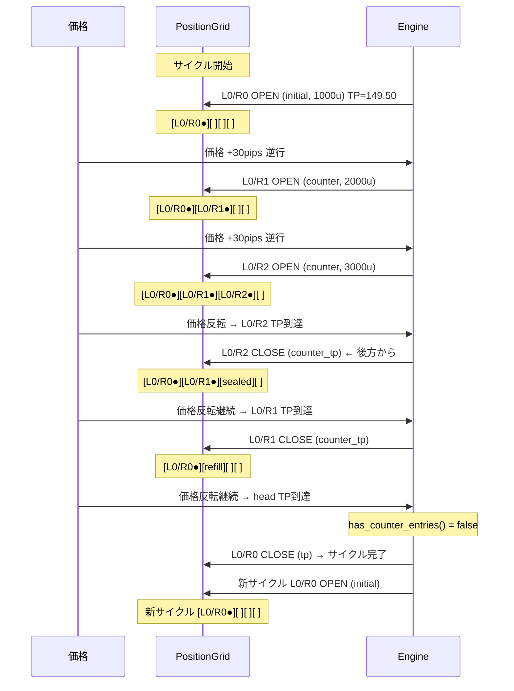
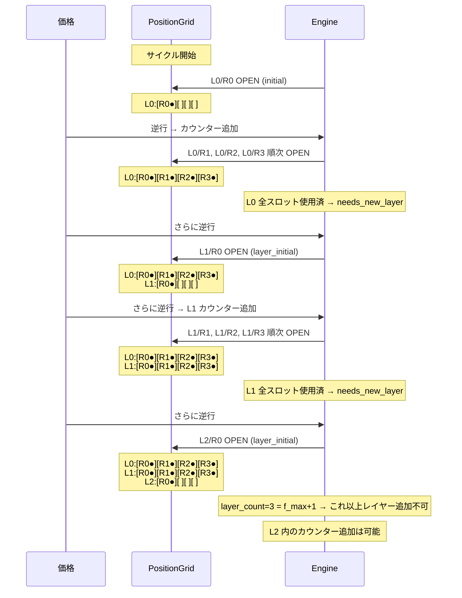
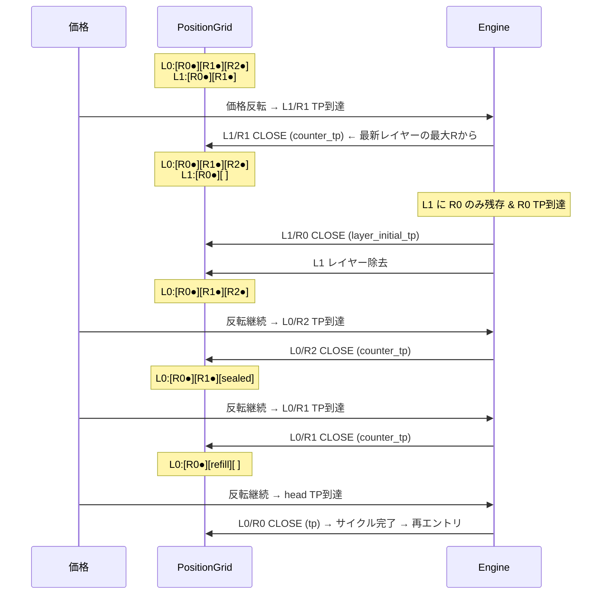
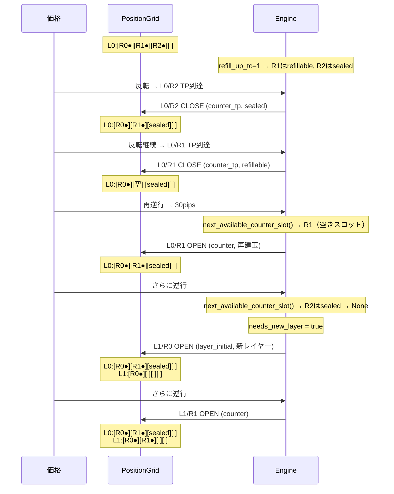
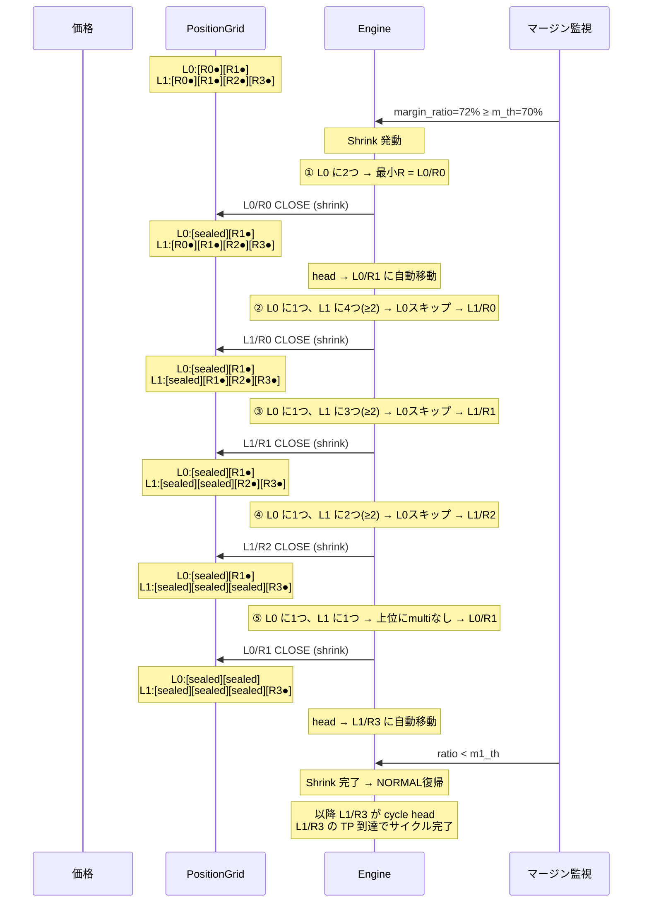
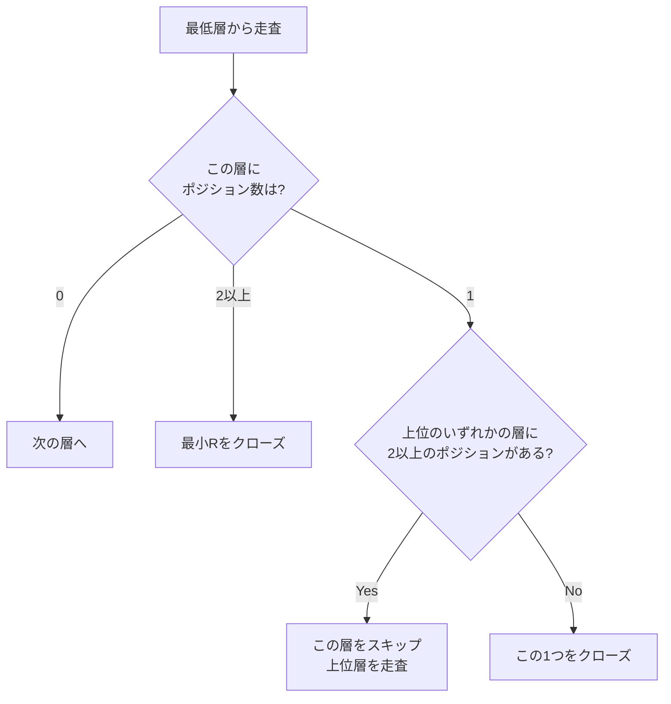
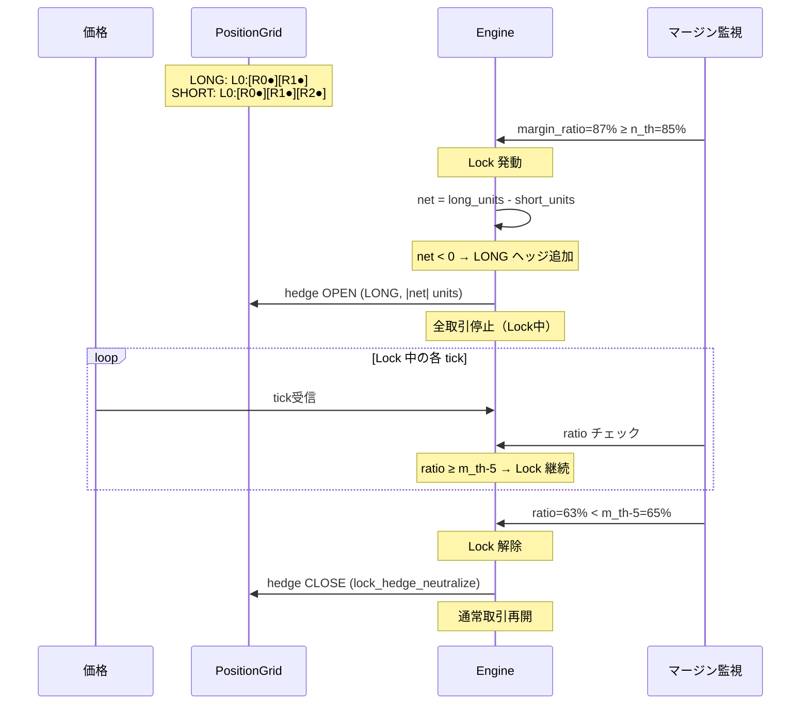
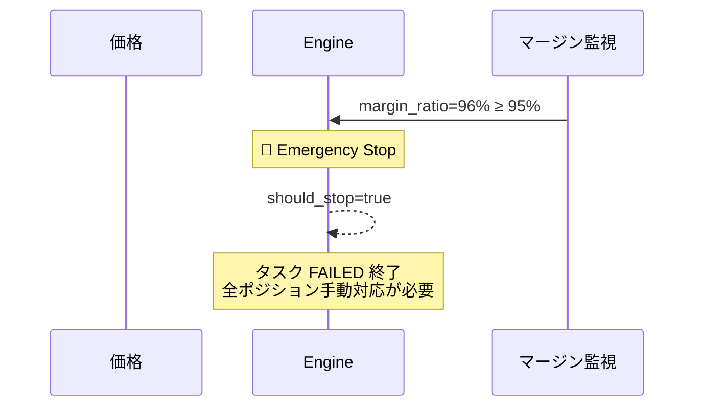
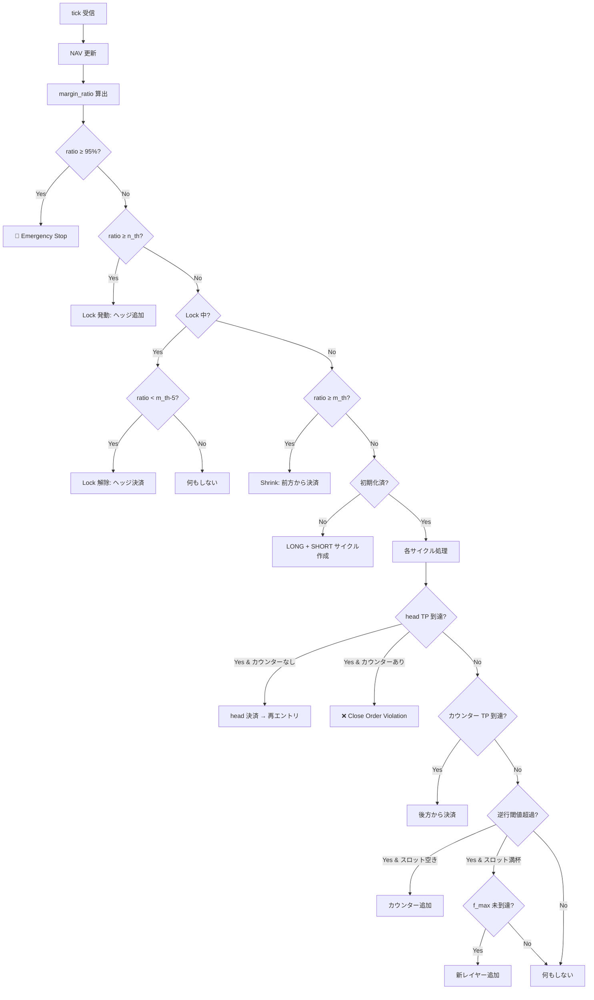

# Snowball Strategy — シーケンス図

## 設定前提

```
r_max = 3, f_max = 2, m_pips = 50, n_pips = 30
refill_up_to = 1, m_th = 70%, m1_th = 50%, n_th = 85%
hedging_enabled = true (LONG + SHORT 並行)
```

以下の図はすべて SHORT サイクル側の動きを示す（LONG は対称）。
価格上昇 = SHORT にとって逆行。

---

## 1. 通常パターン — 建玉→カウンター→全決済→再エントリ



---

## 2. 最大レイヤーまで建玉するパターン



---

## 3. 途中で反転して決済するパターン（後方から順次決済）



---

## 4. 反転→決済→再逆行→再建玉パターン（refill）



---

## 5. Shrink プロテクション — 層保存ルール付き前方決済

Shrink の決済優先順位:
1. 低い階層から順にクローズ
2. 同階層内では R 番号が小さい方から
3. **例外**: 階層にポジションが1つしかない場合、上位のいずれかの階層に
   複数ポジションがあれば、その上位階層の古いポジションを先にクローズ



### 層保存ルールの判定フロー


```

---

## 6. Lock プロテクション — 両建てヘッジ



---

## 7. Emergency Stop



---

## 8. on_tick 全体フロー



---

## PositionGrid 構造

```
サイクル (SHORT, r_max=3, f_max=2)

L0: [R0:initial] [R1:counter] [R2:counter] [R3:counter]
L1: [R0:layer_initial] [R1:counter] [R2:counter] [R3:counter]
L2: [R0:layer_initial] [R1:counter] [R2:counter] [R3:counter]

通常TP決済:  ←←←←←←←←←←←← 後方(newest)から前方(oldest)へ
Shrink決済:  →→→→→→→→→→→→ 前方(oldest)から後方(newest)へ

head_entry() = グリッド内の最古の生存ポジション（動的）
  L0/R0 が決済されたら → L0/R1 が自動的に head に
  L0 が空になったら → L1/R0 が head に
```
