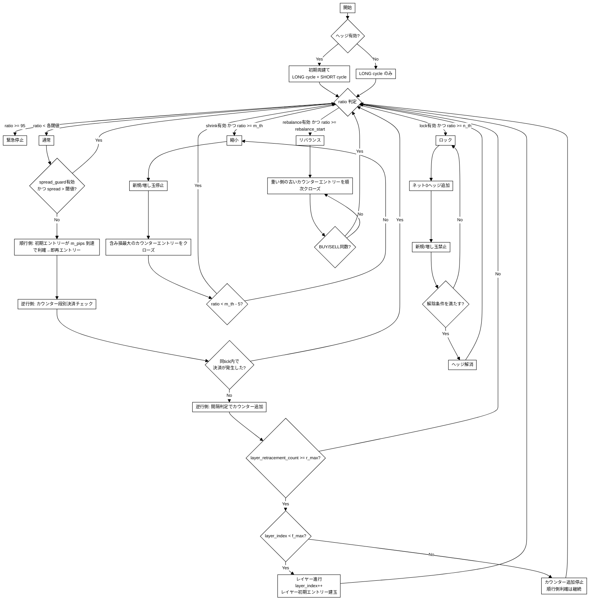
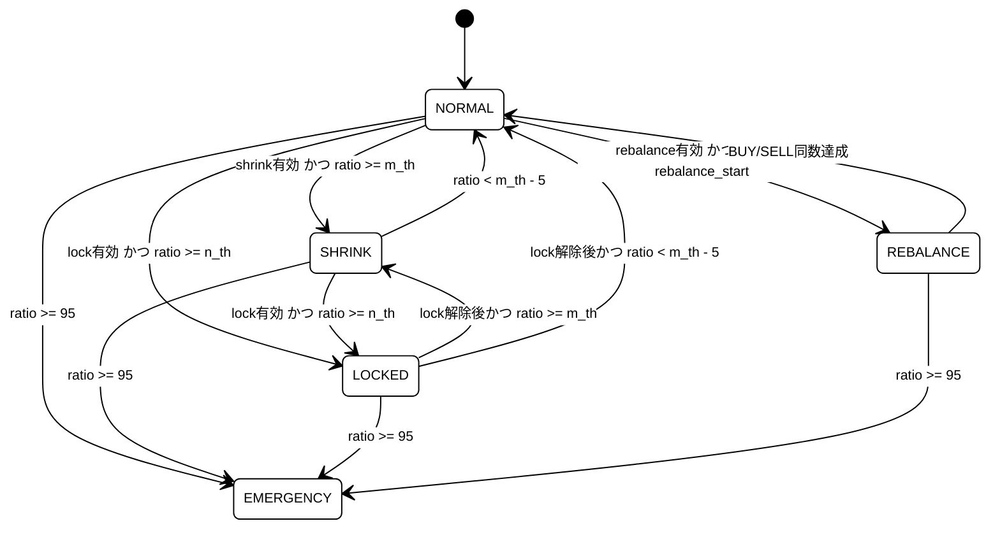

## 1. 目的

- 両建てを基点に、順行側の小刻み利確（回転利確）でキャッシュを積み上げる。
- 逆行側はナンピン（カウンターエントリー）で平均取得価格を寄せ、直近取得分のみを段別決済して平均価格を押し下げる。
- 証拠金比率に応じて段階的に防御し、強制ロスカットを回避する。

## 2. 前提と記号

### 2.1 前提

- 両建て可能口座のみ（日本版 OANDA を想定）
- FIFO 制約なし（米国口座は対象外）
- 対象通貨: `USD_JPY`
- 1 pip = `0.01` 円
- 価格判定・トリガー判定・決済判定は `bid/ask` を使用
- 逆行距離の計測には `mid`（= (bid+ask)/2）を使用（スプレッド歪み回避）
- ヘッジ無効時は LONG のみで初期化（SHORT は建てない）

### 2.2 記号

- $P_{\text{avg}}=\dfrac{\sum_i p_i u_i}{\sum_i u_i}$
- $\mathrm{ratio}=\dfrac{\mathrm{required\_margin}}{\mathrm{NAV}}\times 100$（証拠金比率 %）
- NAV = 口座残高 + 未実現損益
- 証拠金計算: OANDA のネットポジション方式（LONG/SHORT の大きい方のみ）

### 2.3 用語

| 用語 | 説明 |
| --- | --- |
| サイクル | 1つの初期エントリーから完了までの一連のトレード群。LONG/SHORT それぞれ独立に管理される |
| レイヤー | 1サイクル内の `r_max` 到達ごとに進むフェーズ。`layer_index` で管理（0始まり） |
| リトレースメント | 1レイヤー内のカウンターエントリー追加回数。`layer_retracement_count` で管理 |
| カウンターエントリー | 逆行時に追加するナンピンポジション |
| レイヤー初期エントリー | `r_max` 到達後に新レイヤー開始時に建てるエントリー |

### 2.4 パラメータ記号対応

| 記号 | パラメータ名 |
| --- | --- |
| $r_{\max}$ | `r_max` |
| $f_{\max}$ | `f_max` |
| $m_{\mathrm{pips}}$ | `m_pips` |
| $m_{\mathrm{th}}$ | `m_th` |
| $n_{\mathrm{th}}$ | `n_th` |
| $n_{\mathrm{head}}$ | `n_pips_head` |
| $n_{\mathrm{tail}}$ | `n_pips_tail` |
| $n_{\mathrm{flat}}$ | `n_pips_flat_steps` |
| $\gamma_n$ | `n_pips_gamma` |
| $s_{\mathrm{spread}}$ | `spread_guard_pips` |
| $\Delta t_{\mathrm{cool}}$ | `cooldown_sec` |

## 3. パラメータ

### 3.1 建玉・利確（コア）

| Key | 意味 | Default |
| --- | --- | --- |
| `base_units` | 基本ロット (通貨単位) | `1000` |
| `m_pips` | 順行側の利確幅 (pips) | `50` |
| `trend_lot_size` | 順行側エントリーのロット数（`base_units` に乗算） | `1` |
| `r_max` | 1レイヤーあたりの最大カウンターエントリー数 | `7` |
| `f_max` | `r_max` 到達後のレイヤー再試行回数上限 | `3` |
| `post_r_max_base_factor` | `r_max` 到達後の `cycle_base_units` 倍率 | `1` |
| `round_step_pips` | 間隔・TP計算値の丸め単位（pip） | `0.1` |

### 3.2 逆行側間隔（Interval Mode）

間隔モード（`interval_mode`）により、カウンターエントリーの追加間隔の計算方法を選択する。

| `interval_mode` | 動作 |
| --- | --- |
| `constant` | 全段 `n_pips_head` 固定 |
| カーブ系（`additive` / `subtractive` / `multiplicative` / `divisive`） | `n_pips_head` → `n_pips_tail` へガンマカーブで遷移 |
| `manual` | `manual_intervals` 配列でユーザーが段ごとに指定 |

| Key | 意味 | Default | 表示条件 |
| --- | --- | --- | --- |
| `interval_mode` | 間隔モード | `constant` | 常時 |
| `n_pips_head` | 間隔初期値（pip） | `30` | `constant` / カーブ系 |
| `n_pips_tail` | 間隔終端値（pip） | `14` | カーブ系のみ |
| `n_pips_flat_steps` | 初期固定段数 | `2` | カーブ系のみ |
| `n_pips_gamma` | 減衰カーブ係数 | `1.4` | カーブ系のみ |
| `manual_intervals` | 段ごとのpip間隔配列（`r_max` 個） | `[]` | `manual` のみ |

間隔一般式（カーブ系モード）:

1. $k \le n_{\mathrm{flat}}$ のとき: $n_{\mathrm{head}}$
2. $k > n_{\mathrm{flat}}$ のとき: $t = k - n_{\mathrm{flat}}$, $r_{\mathrm{decay}} = r_{\max} - n_{\mathrm{flat}}$, $\mathrm{progress} = t / r_{\mathrm{decay}}$
   - $\mathrm{interval} = n_{\mathrm{head}} - (n_{\mathrm{head}} - n_{\mathrm{tail}}) \cdot \mathrm{progress}^{\gamma_n}$
   - $\gamma > 1$: 緩やかな開始、$\gamma < 1$: 急速な開始

### 3.3 逆行側決済（Counter TP Mode）

決済価格モード（`counter_tp_mode`）により、各段の決済価格の計算方法を選択する。

| `counter_tp_mode` | 動作 |
| --- | --- |
| `weighted_avg` | 同レイヤー内の全ポジション（レイヤー初期エントリー含む）の加重平均価格を決済価格とする（デフォルト） |
| `fixed` | 全段 `counter_tp_pips` 固定 |
| `additive` | `counter_tp_pips + counter_tp_step_amount × (k-1)` |
| `subtractive` | `counter_tp_pips - counter_tp_step_amount × (k-1)`（下限 0.1） |
| `multiplicative` | `counter_tp_pips × counter_tp_multiplier^(k-1)` |
| `divisive` | `counter_tp_pips / counter_tp_multiplier^(k-1)`（下限 0.1） |

| Key | 意味 | Default | 表示条件 |
| --- | --- | --- | --- |
| `counter_tp_mode` | 決済価格モード | `weighted_avg` | 常時 |
| `counter_tp_pips` | 利確幅の基準値（pip） | `25` | `weighted_avg` 以外 |
| `counter_tp_step_amount` | 段階増減量（pip） | `2.5` | `additive` / `subtractive` |
| `counter_tp_multiplier` | 段階乗数 | `1.2` | `multiplicative` / `divisive` |

### 3.4 動的利確（ATR）

| Key | 意味 | Default | 表示条件 |
| --- | --- | --- | --- |
| `dynamic_tp_enabled` | ATR動的利確の有効/無効 | `false` | 常時 |
| `atr_period` | ATR期間 | `14` | 有効時 |
| `atr_timeframe` | ATR計算足（`M1`/`M5`/`M15`/`M30`/`H1`/`H4`） | `M1` | 有効時 |
| `atr_baseline_lookback` | ATR基準値算出本数 | `96` | 有効時 |
| `m_pips_min` | 動的 `m_pips` の下限 | `12` | 有効時 |
| `m_pips_max` | 動的 `m_pips` の上限 | `80` | 有効時 |

### 3.5 証拠金保護

各保護レベルは個別に有効/無効を切り替え可能。

| Key | 意味 | Default | 表示条件 |
| --- | --- | --- | --- |
| `rebalance_enabled` | リバランス機能の有効/無効 | `false` | 常時 |
| `rebalance_start_ratio` | リバランス開始の証拠金比率（%） | `60` | リバランス有効時 |
| `rebalance_end_ratio` | リバランス終了の証拠金比率（%） | `50` | リバランス有効時 |
| `shrink_enabled` | 縮小モードの有効/無効 | `true` | 常時 |
| `m_th` | 証拠金防御レベル1 - 縮小（%） | `70` | 縮小有効時 |
| `lock_enabled` | ロックモードの有効/無効 | `true` | 常時 |
| `n_th` | 証拠金防御レベル2 - ロック（%） | `85` | ロック有効時 |
| `cooldown_sec` | ロック解除後の再開待機（秒） | `300` | ロック有効時 |

### 3.6 スプレッドガード

| Key | 意味 | Default | 表示条件 |
| --- | --- | --- | --- |
| `spread_guard_enabled` | スプレッドガードの有効/無効 | `false` | 常時 |
| `spread_guard_pips` | 新規/増し玉停止スプレッド閾値 | `2.5` | 有効時 |

### 3.7 バリデーション

- `shrink_enabled` かつ `lock_enabled` のとき: $m_{\mathrm{th}} < n_{\mathrm{th}} < 100$
- `shrink_enabled` のとき: $0 < m_{\mathrm{th}} < 100$
- `lock_enabled` のとき: $0 < n_{\mathrm{th}} < 100$
- `dynamic_tp_enabled` のとき: $m_{\mathrm{pips,min}} \le m_{\mathrm{pips}} \le m_{\mathrm{pips,max}}$
- $n_{\mathrm{head}} \ge n_{\mathrm{tail}} > 0$
- $n_{\mathrm{flat}} < r_{\max}$
- `counter_tp_mode` が `weighted_avg` 以外のとき: $\mathrm{counter\_tp\_pips} > 0$
- `rebalance_enabled` のとき: $rebalance\_start\_ratio > rebalance\_end\_ratio > 0$
- `interval_mode` が `manual` のとき: `manual_intervals` の要素数 = `r_max`、全値 ≥ 1

## 4. 全体フロー

## 5. サイクルの構造

各サイクルは以下の要素で構成される:

| フィールド | 型 | 説明 |
| --- | --- | --- |
| `cycle_id` | int | サイクルID（= 初期エントリーの `entry_id`） |
| `direction` | LONG / SHORT | サイクルの方向 |
| `initial_entry` | Entry | 順行側の初期エントリー（回転利確対象） |
| `counter_entries` | list[Entry] | 逆行側のカウンターエントリー群 |
| `hedge_entries` | list[Entry] | ロックモード時のヘッジエントリー群 |
| `layer_initial_entries` | dict[int, Entry] | レイヤー2以降の初期エントリー（レイヤー番号→Entry） |
| `layer_retracement_count` | int | 現レイヤー内のカウンター追加回数（0始まり） |
| `layer_index` | int | 現在のレイヤーインデックス（0始まり、`r_max` 到達ごとに+1） |
| `cycle_base_units` | int | 現在のロット基準値（`r_max` 到達後に `base_units × post_r_max_base_factor` に更新） |
| `counter_close_count` | int | カウンターTPクローズの累計回数（ロットサイズ計算に使用） |
| `completed` | bool | サイクル完了フラグ |

サイクルのライフサイクル:

1. 初期エントリーを建玉してサイクル開始
2. 逆行時にカウンターエントリーを追加（最大 `r_max` 回/レイヤー）
3. カウンターエントリーがTPに到達したら段別決済
4. `r_max` 到達でレイヤー進行（最大 `f_max` 回）
5. 初期エントリーが `m_pips` に到達したら利確 → サイクル完了 → 同方向で新サイクル開始

## 6. 順行側ロジック（回転利確）

### 6.1 初期化

戦略開始時に以下を建玉する:

- ヘッジ有効時: LONG サイクルと SHORT サイクルを同時に作成。各サイクルの初期エントリーは `trend_lot_size × base_units` 通貨単位。
- ヘッジ無効時: LONG サイクルのみ作成。

### 6.2 利確と再エントリー

初期エントリーの価格が順行方向に `m_pips` 到達で利確し、即座に同方向で新サイクルを開始する。

利確条件:

- LONG: $bid \ge entry\_price + m_{\mathrm{pips}} \times pip\_size$
- SHORT: $ask \le entry\_price - m_{\mathrm{pips}} \times pip\_size$

利確後の処理:

1. 初期エントリーをクローズ
2. サイクルを `completed = true` に設定
3. 同方向で新サイクルを作成（`_create_cycle`）

注: サイクル完了時、そのサイクルに残存するカウンターエントリーやレイヤー初期エントリーは新サイクルには引き継がれない。これらは完了したサイクルに属したまま残る。

## 7. 逆行側ロジック（カウンターエントリー）

### 7.1 カウンター追加の前提条件

以下の全てを満たす場合にのみカウンター追加を評価する:

1. サイクルが未完了（`completed == false`）
2. `layer_index < f_max`（レイヤー上限に未到達）
3. `layer_retracement_count < r_max`（現レイヤーの追加上限に未到達）
4. 初期エントリーが含み損状態（`unrealised_loss_pips > 0`）
5. 同一tick内でカウンターTPクローズが発生していない

条件5は、カウンターTPクローズ後に `layer_retracement_count` が0にリセットされるため、同一tick内で即座に再エントリー条件を満たしてしまう問題を防ぐためのガードである。次のtickで改めて逆行距離を評価してから再エントリーを判断する。

### 7.2 逆行距離の計測

- 初回カウンター追加（カウンターリストが空）: 初期エントリーの `entry_price` と現在の `mid` 価格の差をpipsで計測
- 2回目以降: 直近のカウンターエントリー（最大 `step` 番号）の `entry_price` と現在の `mid` 価格の差をpipsで計測

### 7.3 追加間隔の判定

逆行距離が `counter_interval_pips(k, cfg)` 以上の場合にカウンターエントリーを追加する。`k` は現レイヤー内の追加回数（1始まり）。

### 7.4 ロットサイズの計算

ロットサイズは常に以下の式で計算される:

$$lot = (layer\_retracement\_count + 2) \times cycle\_base\_units$$

- R1: `(0 + 2) × 1000 = 2000`（2ロット）
- R2: `(1 + 2) × 1000 = 3000`（3ロット）
- R_k: `(k-1 + 2) × 1000 = (k+1) × 1000`

段別決済後も同じ式が適用される。`layer_retracement_count` が0にリセットされるため、次の追加は再び2ロットから始まる。

### 7.5 カウンター追加後の状態更新

1. エントリーを `counter_entries` に追加
2. `layer_retracement_count` をインクリメント（初回追加時は1に設定）
3. `counter_tp_mode` が `weighted_avg` 以外の場合、既存カウンターエントリーの `close_price` を各エントリーの `step` に基づいて再計算

## 8. 決済ロジック

### 8.1 決済対象

決済対象は常に最大 `step` 番号のカウンターエントリー1つのみ。1tickにつき最大1件の決済を行い、次のtickで残りを再評価する。これにより同一tick内でのカスケード決済を防止する。

### 8.2 決済価格の計算

各カウンターエントリーには建玉時に `close_price`（決済価格）が設定される。

`weighted_avg` モード:

- 決済価格 = 同レイヤー内の全ポジション（新規エントリー + 既存カウンター + レイヤー初期エントリー）の加重平均価格
- 各エントリーの決済価格は建玉時点の加重平均で固定され、後続の追加では更新されない

その他のモード（`fixed` / `additive` / `subtractive` / `multiplicative` / `divisive`）:

- 決済価格 = エントリー価格 ± `counter_tp_pips(k)` × pip_size
- 新しいカウンターエントリー追加時に、既存エントリーの決済価格も各自の `step` に基づいて再計算される

### 8.3 決済判定

- LONG: $bid \ge close\_price$
- SHORT: $ask \le close\_price$

### 8.4 決済後の状態更新

1. エントリーを `counter_entries` から削除
2. `layer_retracement_count` を 0 にリセット
3. `counter_close_count` をインクリメント

## 9. レイヤー進行（$r_{\max}$ 到達後）

### 9.1 レイヤー進行の条件

`layer_retracement_count >= r_max` かつ `layer_index < f_max` のとき、レイヤーを進行する。

### 9.2 レイヤー進行時の処理

1. `layer_retracement_count` を 0 にリセット
2. `layer_index` を +1
3. `cycle_base_units` を `base_units × post_r_max_base_factor` に更新
4. 新レイヤーの初期エントリーを建玉（`layer_initial` ロール）:
   - ロット: `trend_lot_size × cycle_base_units`
   - 決済価格（`weighted_avg` モード時）: 前レイヤーの全エントリー（初期/レイヤー初期 + カウンター）と新エントリーの加重平均
   - 決済価格（その他のモード時）: 現在価格 ± `m_pips` × pip_size
   - `layer_initial_entries[新レイヤー番号]` に格納

レイヤー番号は `layer_index + 2` で計算される（layer_index=0 のときレイヤー1が初期レイヤー、layer_index=1 でレイヤー2に進行しレイヤー番号3のエントリーが建つ）。

### 9.3 $f_{\max}$ 到達時

`layer_index >= f_max` の場合、カウンターエントリーの新規追加を停止する。順行側の回転利確と既存カウンターエントリーの段別決済は継続する。

## 10. 証拠金保護

保護レベルは5段階で、各レベルは個別に有効/無効を切り替え可能（緊急停止は常時有効）。

### 10.1 保護レベル一覧

| レベル | 状態 | 条件 | 有効/無効 |
| --- | --- | --- | --- |
| `NORMAL` | 通常 | 全閾値未満 | - |
| `REBALANCE` | リバランス | `ratio >= rebalance_start_ratio` | `rebalance_enabled` |
| `SHRINK` | 縮小 | `ratio >= m_th` | `shrink_enabled` |
| `LOCKED` | ロック | `ratio >= n_th` | `lock_enabled` |
| `EMERGENCY` | 緊急停止 | `ratio >= 95` | 常時有効 |

### 10.2 リバランス（`rebalance_enabled = true`）

1. `ratio >= rebalance_start_ratio` に到達したら開始
2. LONG/SHORT のうち重い側のカウンターエントリーを `step` 番号の若い順（古い順）でクローズ
3. LONG 合計ユニット数 = SHORT 合計ユニット数になるまで継続

### 10.3 縮小モード（`shrink_enabled = true`、`ratio >= m_th`）

1. 新規エントリーとカウンター追加を停止
2. 全アクティブサイクルのカウンターエントリーから含み損が最も大きいものを1つクローズ
3. `ratio < m_th - 5` まで通常モードへ戻さない（ヒステリシス）

### 10.4 ロックモード（`lock_enabled = true`、`ratio >= n_th`）

ロック開始:

1. 全アクティブサイクルの LONG/SHORT ユニット数の差分を計算
2. 差分がある場合、ネットエクスポージャを0にするヘッジエントリーを追加（`hedge` ロール）
3. ヘッジエントリーは最初のアクティブサイクルの `hedge_entries` に格納
4. 以降は全ての新規/カウンター追加を禁止

ロック解除条件（全て満たす）:

1. `ratio < m_th - 5`
2. `spread_guard_enabled` の場合: スプレッド ≤ `spread_guard_pips`
3. `cooldown_sec` 経過

解除後:

- ヘッジエントリーをクローズ
- ratio に応じて縮小モードまたは通常モードへ復帰

### 10.5 緊急停止（`ratio >= 95`、常時有効）

戦略を即座に停止し、`should_stop = True` を返す。ポジションの自動クローズは行わない。

## 11. tick 処理フロー

各 tick で以下の順序で処理される。各ステップは排他的で、保護系の処理が発生した場合はそこで return する。

1. NAV 更新（口座残高 + 全アクティブサイクルの未実現損益）
2. 証拠金比率の計算
3. 緊急停止チェック（`ratio >= 95` → 即停止）
4. ロック開始チェック（`lock_enabled` かつ `ratio >= n_th` → ヘッジ追加して return）
5. ロック中の解除チェック（解除条件を満たせばヘッジ解消して return）
6. 縮小モードチェック（`shrink_enabled` かつ `ratio >= m_th` → 最大損失エントリーをクローズして return）
7. リバランスチェック（`rebalance_enabled` かつ `ratio >= rebalance_start_ratio` → BUY/SELL均衡化して return）
8. 通常モード復帰
9. スプレッドガードチェック（`spread_guard_enabled` かつ `spread > spread_guard_pips` → 何もせず return）
10. 初期化（未初期化の場合、サイクル作成して return）
11. アクティブサイクルごとに以下を順次実行:
    1. 順行側: 初期エントリーのTP判定 → 利確＆再エントリー
    2. 逆行側: カウンター段別決済チェック（最大step のみ、1件/tick）
    3. 逆行側: カウンター追加チェック（ただし 11-2 で決済が発生した場合はスキップ）

## 12. 具体例（LONG方向、正常状態）

前提:

- 初回 BUY: `100.00`
- `interval_mode = constant`, `n_pips_head = 30`
- `counter_tp_mode = weighted_avg`
- `r_max = 7`, `base_units = 1000`
- 想定: 円高進行（`USD/JPY` が下落）時に LONG を積み増す

### 12.1 通常サイクル（レイヤー1）

| 段 | BUY価格 | 間隔 (pip) | ロット | 決済価格 | 決済対象 |
| --- | --- | --- | --- | --- | --- |
| 初期 | `100.00` | - | 1,000 | `100.50`（順行利確） | 順行側 |
| R1 | `99.70` | 30 | 2,000 | 加重平均 | R1のみ |
| R2 | `99.40` | 30 | 3,000 | 加重平均 | R2のみ |
| R3 | `99.10` | 30 | 4,000 | 加重平均 | R3のみ |
| R4 | `98.80` | 30 | 5,000 | 加重平均 | R4のみ |
| R5 | `98.50` | 30 | 6,000 | 加重平均 | R5のみ |
| R6 | `98.20` | 30 | 7,000 | 加重平均 | R6のみ |
| R7 | `97.90` | 30 | 8,000 | 加重平均 | R7のみ |

- 「決済価格」は `weighted_avg` モードの場合、初期エントリーを含む全ポジションの加重平均。
- 「決済対象」は最大 step 番号のエントリーのみ。他の段は保持。
- ロットは `(layer_retracement_count + 2) × base_units`（初回サイクル）。

### 12.2 段別決済後の再逆行

R7 が加重平均でTPクローズされた場合:

1. `layer_retracement_count` → 0 にリセット
2. `counter_close_count` → 1 にインクリメント
3. 次のtick以降で再度逆行した場合、ロット `2 × base_units` = 2,000 から再スタート
4. ロットは常に `(layer_retracement_count + 2) × base_units`

### 12.3 レイヤー進行（$r_{\max}$ 到達後）

R7 まで追加して `layer_retracement_count >= r_max` に到達した場合（段別決済なしで到達）:

1. `layer_index` → 1
2. `layer_retracement_count` → 0
3. `cycle_base_units` → `base_units × post_r_max_base_factor`
4. レイヤー初期エントリーを建玉（レイヤー番号3、`trend_lot_size × cycle_base_units`）
5. レイヤー初期エントリーのTP = 前レイヤー全エントリーと新エントリーの加重平均
6. 以降、レイヤー2として同じロジックでカウンター追加を再開（R1=2ロット, R2=3ロット, ...）
