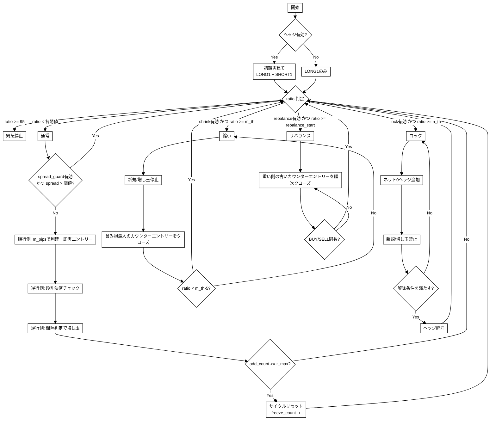
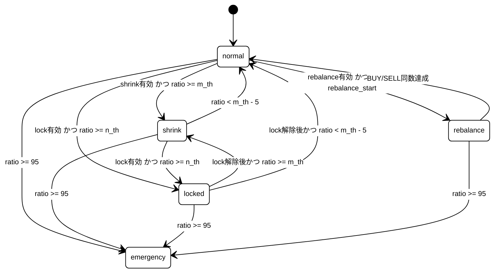

## 1. 目的

- 両建てを基点に、順行側の小刻み利確でキャッシュを積み上げる。
- 逆行側はナンピンで平均取得価格を寄せ、段別決済（直近取得分のみ利確）で平均価格を押し下げる。
- 証拠金比率に応じて段階的に防御し、強制ロスカットを回避する。

## 2. 前提と記号

### 2.1 前提

- 両建て可能口座のみ（日本版 OANDA を想定）
- FIFO 制約なし（米国口座は対象外）
- 対象通貨: `USD_JPY`
- 1 pip = `0.01` 円
- 価格判定・トリガー判定・決済判定は `bid/ask` を使用
- 逆行距離の計測には `mid`（= (bid+ask)/2）を使用（スプレッド歪み回避）
- ヘッジ無効時は LONG のみで初期化（SHORT は建てない）

### 2.2 記号

- $P_{\text{avg}}=\dfrac{\sum_i p_i u_i}{\sum_i u_i}$
- $\mathrm{ratio}=\dfrac{\mathrm{required\_margin}}{\mathrm{NAV}}\times 100$（証拠金比率 %）
- $r_{\max}$: 1サイクルあたりの逆行側最大増し玉回数（初回建玉を含まない）
- $a$: 追加建玉回数（最大 $r_{\max}$）
- NAV = 口座残高 + 未実現損益
- 証拠金計算: OANDA のネットポジション方式（LONG/SHORT の大きい方のみ）

### 2.3 パラメータ記号対応

- $r_{\max}\leftrightarrow$ `r_max`, $f_{\max}\leftrightarrow$ `f_max`
- $a\leftrightarrow$ `add_count`, $f\leftrightarrow$ `freeze_count`
- $m_{\mathrm{th}}\leftrightarrow$ `m_th`, $n_{\mathrm{th}}\leftrightarrow$ `n_th`
- $m_{\mathrm{pips}}\leftrightarrow$ `m_pips`
- $n_{\mathrm{head}}\leftrightarrow$ `n_pips_head`, $n_{\mathrm{tail}}\leftrightarrow$ `n_pips_tail`
- $n_{\mathrm{flat}}\leftrightarrow$ `n_pips_flat_steps`, $\gamma_n\leftrightarrow$ `n_pips_gamma`
- $s_{\mathrm{spread}}\leftrightarrow$ `spread_guard_pips`, $\Delta t_{\mathrm{cool}}\leftrightarrow$ `cooldown_sec`

## 3. パラメータ

### 3.1 建玉・利確（コア）

| Key                      | 意味                                              | Default |
| ------------------------ | ------------------------------------------------- | ------- |
| `base_units`             | 基本ロット (通貨単位)                             | `1000`  |
| `m_pips`                 | 順行側の利確幅 (pips)                             | `50`    |
| `trend_lot_size`         | 順行側エントリーのロット数（`base_units` に乗算） | `1`     |
| `r_max`                  | 逆行側の最大増し玉回数（初回建玉を含まない）      | `7`     |
| `f_max`                  | `r_max` 到達後の再試行回数上限                    | `3`     |
| `post_r_max_base_factor` | `r_max` 超過サイクル時の初期ロット倍率            | `1`     |
| `round_step_pips`        | 間隔・TP計算値の丸め単位（pip）                   | `0.1`   |

### 3.2 逆行側間隔（Interval Mode）

間隔モード（`interval_mode`）により、増し玉間隔の計算方法を選択する。

| `interval_mode`                                            | 動作                                               |
| ---------------------------------------------------------- | -------------------------------------------------- |
| `constant`                                                 | 全段 `n_pips_head` 固定                            |
| `additive` / `subtractive` / `multiplicative` / `divisive` | `n_pips_head` → `n_pips_tail` へガンマカーブで遷移 |
| `manual`                                                   | `manual_intervals` 配列でユーザーが段ごとに指定    |

| Key                 | 意味                              | Default    | 表示条件              |
| ------------------- | --------------------------------- | ---------- | --------------------- |
| `interval_mode`     | 間隔モード                        | `constant` | 常時                  |
| `n_pips_head`       | 間隔初期値（pip）                 | `30`       | `constant` / カーブ系 |
| `n_pips_tail`       | 間隔終端値（pip）                 | `14`       | カーブ系のみ          |
| `n_pips_flat_steps` | 初期固定段数                      | `2`        | カーブ系のみ          |
| `n_pips_gamma`      | 減衰カーブ係数                    | `1.4`      | カーブ系のみ          |
| `manual_intervals`  | 段ごとのpip間隔配列（`r_max` 個） | `[]`       | `manual` のみ         |

間隔一般式（カーブ系モード）:

1. $k \le n_{\mathrm{flat}}$ のとき: $n_{\mathrm{head}}$
2. $k > n_{\mathrm{flat}}$ のとき: $t = k - n_{\mathrm{flat}}$, $r_{\mathrm{decay}} = r_{\max} - n_{\mathrm{flat}}$, $\mathrm{progress} = t / r_{\mathrm{decay}}$
   - $\mathrm{interval} = n_{\mathrm{head}} - (n_{\mathrm{head}} - n_{\mathrm{tail}}) \cdot \mathrm{progress}^{\gamma_n}$
   - $\gamma > 1$: 緩やかな開始、$\gamma < 1$: 急速な開始

### 3.3 逆行側決済（Counter TP Mode）

決済価格モード（`counter_tp_mode`）により、各段の決済価格の計算方法を選択する。

| `counter_tp_mode` | 動作                                                           |
| ----------------- | -------------------------------------------------------------- |
| `weighted_avg`    | 加重平均価格を決済価格とする（デフォルト）                     |
| `fixed`           | 全段 `counter_tp_pips` 固定                                    |
| `additive`        | `counter_tp_pips + counter_tp_step_amount × (k-1)`             |
| `subtractive`     | `counter_tp_pips - counter_tp_step_amount × (k-1)`（下限 0.1） |
| `multiplicative`  | `counter_tp_pips × counter_tp_multiplier^(k-1)`                |
| `divisive`        | `counter_tp_pips / counter_tp_multiplier^(k-1)`（下限 0.1）    |

| Key                      | 意味                  | Default        | 表示条件                      |
| ------------------------ | --------------------- | -------------- | ----------------------------- |
| `counter_tp_mode`        | 決済価格モード        | `weighted_avg` | 常時                          |
| `counter_tp_pips`        | 利確幅の基準値（pip） | `25`           | `weighted_avg` 以外           |
| `counter_tp_step_amount` | 段階増減量（pip）     | `2.5`          | `additive` / `subtractive`    |
| `counter_tp_multiplier`  | 段階乗数              | `1.2`          | `multiplicative` / `divisive` |

### 3.4 動的利確（ATR）

| Key                     | 意味                                         | Default | 表示条件 |
| ----------------------- | -------------------------------------------- | ------- | -------- |
| `dynamic_tp_enabled`    | ATR動的利確の有効/無効                       | `false` | 常時     |
| `atr_period`            | ATR期間                                      | `14`    | 有効時   |
| `atr_timeframe`         | ATR計算足（`M1`/`M5`/`M15`/`M30`/`H1`/`H4`） | `M1`    | 有効時   |
| `atr_baseline_lookback` | ATR基準値算出本数                            | `96`    | 有効時   |
| `m_pips_min`            | 動的 `m_pips` の下限                         | `12`    | 有効時   |
| `m_pips_max`            | 動的 `m_pips` の上限                         | `80`    | 有効時   |

### 3.5 証拠金保護

各保護レベルは個別に有効/無効を切り替え可能。

| Key                     | 意味                            | Default | 表示条件         |
| ----------------------- | ------------------------------- | ------- | ---------------- |
| `rebalance_enabled`     | リバランス機能の有効/無効       | `false` | 常時             |
| `rebalance_start_ratio` | リバランス開始の証拠金比率（%） | `60`    | リバランス有効時 |
| `rebalance_end_ratio`   | リバランス終了の証拠金比率（%） | `50`    | リバランス有効時 |
| `shrink_enabled`        | 縮小モードの有効/無効           | `true`  | 常時             |
| `m_th`                  | 証拠金防御レベル1 - 縮小（%）   | `70`    | 縮小有効時       |
| `lock_enabled`          | ロックモードの有効/無効         | `true`  | 常時             |
| `n_th`                  | 証拠金防御レベル2 - ロック（%） | `85`    | ロック有効時     |
| `cooldown_sec`          | ロック解除後の再開待機（秒）    | `300`   | ロック有効時     |

### 3.6 スプレッドガード

| Key                    | 意味                          | Default | 表示条件 |
| ---------------------- | ----------------------------- | ------- | -------- |
| `spread_guard_enabled` | スプレッドガードの有効/無効   | `false` | 常時     |
| `spread_guard_pips`    | 新規/増し玉停止スプレッド閾値 | `2.5`   | 有効時   |

### 3.7 バリデーション

- `shrink_enabled` かつ `lock_enabled` のとき: $m_{\mathrm{th}} < n_{\mathrm{th}} < 100$
- `shrink_enabled` のとき: $0 < m_{\mathrm{th}} < 100$
- `lock_enabled` のとき: $0 < n_{\mathrm{th}} < 100$
- `dynamic_tp_enabled` のとき: $m_{\mathrm{pips,min}} \le m_{\mathrm{pips}} \le m_{\mathrm{pips,max}}$
- $n_{\mathrm{head}} \ge n_{\mathrm{tail}} > 0$
- $n_{\mathrm{flat}} < r_{\max}$
- `counter_tp_mode` が `weighted_avg` 以外のとき: $\mathrm{counter\_tp\_pips} > 0$
- `rebalance_enabled` のとき: $rebalance\_start\_ratio > rebalance\_end\_ratio > 0$
- `interval_mode` が `manual` のとき: `manual_intervals` の要素数 = `r_max`、全値 ≥ 1

## 4. 全体フロー

## 5. 順行側ロジック（回転利確）

### 5.1 初期化

1. 戦略開始時点で以下を建玉する:
   - ヘッジ有効時: `LONG (trend_lot_size × base_units)` と `SHORT (trend_lot_size × base_units)` を同時建玉
   - ヘッジ無効時: `LONG (trend_lot_size × base_units)` のみ
2. 以下の 2 バスケットを維持する: `trend_basket`（順行方向の回転利確用）, `counter_basket`（逆行方向の雪玉ナンピン用）。
3. `add_count = 0`, `cycle_base_units = base_units` で初期化。

### 5.2 利確と再エントリー

- 価格が順行し、$entry\_price \pm m_{\mathrm{pips}}$ 到達で利確する。
- 利確直後、同方向に `trend_lot_size × base_units` を即時再エントリーする。

実装条件:

- LONG 利確: $bid \ge long\_entry + m_{\mathrm{pips}}\cdot pip\_size$
- SHORT 利確: $ask \le short\_entry - m_{\mathrm{pips}}\cdot pip\_size$

注: `dynamic_tp_enabled = true` の場合、ATR に基づく動的調整が将来的に適用される（現在は静的 `m_pips` を使用）。

## 6. 逆行側ロジック（雪玉ナンピン）

### 6.1 増し玉ルール

- 逆行方向に $n_{\mathrm{interval}}(k)$ 以上離れたら 1 段追加。
- 逆行距離は `mid` 価格で計測（スプレッド歪み回避）。
- ロットサイズ:
  - 初回サイクル（段別決済前）: $lot\_k = (add\_count + 2) \cdot cycle\_base\_units$（順行側エントリーを position 1 として数える）
  - 段別決済後の再構築: $lot\_k = (add\_count + 1) \cdot cycle\_base\_units$（1 から再スタート）
- $add\_count < r_{\max}$ の間だけ追加を許可。
- 追加後に `add_count` をインクリメント。

### 6.2 逆行側の起点判定

カウンターバスケットが空の場合、トレンドバスケット内で最も含み損の大きいエントリーの方向を逆行方向として判定する。

### 6.3 増し玉間隔

`interval_mode` に応じた計算（セクション 3.2 参照）。全モードで `round_step_pips` 単位に丸められる。

## 7. 決済ロジック

### 7.1 決済価格の計算

各段の建玉には、取得時に決済価格を設定する。計算方法は `counter_tp_mode` に依存する。

`weighted_avg` モード（デフォルト）:

- 決済価格 = 同方向の全ポジション（トレンドバスケット内の同方向エントリーを含む）の加重平均価格
- 各エントリーの決済価格は追加時点の加重平均で固定され、後続の追加で上書きされない

その他のモード（`fixed` / `additive` / `subtractive` / `multiplicative` / `divisive`）:

- 決済価格 = エントリー価格 ± TP pips × pip_size
- 新しいエントリー追加時に、既存エントリーの決済価格も再計算される

### 7.2 決済判定

現在価格が決済価格に達したら、その段のポジションをクローズする。

- LONG ポジションの場合: $bid \ge 決済価格$ でクローズ
- SHORT ポジションの場合: $ask \le 決済価格$ でクローズ

決済の原則:

- 決済対象は直近取得分（最大 step 番号）のみ。古い段は保持し続ける。
- 段別決済後、`add_count` を 0 にリセットし、次の増し玉は基本ロットから再スタートする。

### 7.3 決済後の再逆行時

段別決済後に再度逆行した場合、ロット1から再スタートする。

例:

- 段2（2 lot）で決済 → `add_count = 0` → 再逆行 → 1 lotで再エントリー、次は2 lot...
- 段3（3 lot）で決済 → `add_count = 0` → 再逆行 → 1 lotで再エントリー、次は2 lot...

## 8. $r_{\max}$ 到達後のロジック

### 8.1 サイクル再試行

$r_{\max}$ 到達後、ロット数と間隔をリセットして同一ロジックのサイクルを最初から繰り返す。

1. $add\_count \ge r_{\max}$ 到達時点で $add\_count=0$, $freeze\_count \leftarrow freeze\_count+1$ とする。
2. ロット数を更新: $cycle\_base\_units \leftarrow base\_units \cdot post\_r\_max\_base\_factor$
3. 間隔一般式 $n_{\mathrm{interval}}(k)$ を $k=1$ からリセット。
4. 通常サイクルと完全に同一のロジックで再度建玉する。

### 8.2 $f_{\max}$ 超過時

- $freeze\_count \ge f_{\max}$ で逆行側の新規建玉を停止。
- 順行側の回転利確は継続。
- 逆行側の段別決済は継続（既存ポジションの利確は許可）。

## 9. 証拠金保護

保護レベルは 5 段階で、各レベルは個別に有効/無効を切り替え可能（緊急停止は常時有効）。

### 9.1 保護レベル一覧

| レベル      | 状態       | 条件                             | 有効/無効           |
| ----------- | ---------- | -------------------------------- | ------------------- |
| `NORMAL`    | 通常       | 全閾値未満                       | -                   |
| `REBALANCE` | リバランス | `ratio >= rebalance_start_ratio` | `rebalance_enabled` |
| `SHRINK`    | 縮小       | `ratio >= m_th`                  | `shrink_enabled`    |
| `LOCKED`    | ロック     | `ratio >= n_th`                  | `lock_enabled`      |
| `EMERGENCY` | 緊急停止   | `ratio >= 95`                    | 常時有効            |

### 9.2 BUY/SELL 同数復帰（リバランス）

`rebalance_enabled = true` の場合のみ動作。

1. $\mathrm{ratio} \ge rebalance\_start\_ratio$ に到達したら開始。
2. 逆行バスケットの建玉を step 番号の若い順（古い順）で縮小し、BUY/SELL を同数量へ寄せる。
3. BUY/SELL が同数になるまで継続。

### 9.3 レベル1: $\mathrm{ratio} \ge m_{\mathrm{th}}$（縮小モード）

`shrink_enabled = true` の場合のみ動作。

1. 新規エントリーとナンピンを停止（利確クローズのみ許可）。
2. カウンターバスケット内で含み損が最も大きいエントリーを 1 つクローズ。
3. $\mathrm{ratio} < m_{\mathrm{th}}-5$ まで通常モードへ戻さない（ヒステリシス）。

### 9.4 レベル2: $\mathrm{ratio} \ge n_{\mathrm{th}}$（ロックモード）

`lock_enabled = true` の場合のみ動作。

1. 直ちにネットエクスポージャを0にするヘッジを追加（`lock_hedge`）。
   - LONG > SHORT の場合: 差分を SHORT で追加
   - SHORT > LONG の場合: 差分を LONG で追加
2. 以降は全ての新規/ナンピンを禁止し、評価損益の変動を抑制。

解除条件（全て満たす）:

1. $\mathrm{ratio} < m_{\mathrm{th}}-5$
2. `spread_guard_enabled` の場合: スプレッド $\le spread\_guard\_pips$
3. `cooldown_sec` 経過

解除後:

- `lock_hedge` を解消
- 解消完了後に通常モード（または ratio に応じて縮小モード）へ復帰

### 9.5 緊急停止: $\mathrm{ratio} \ge 95$

常時有効。戦略を即座に停止し、`should_stop = True` を返す。

## 10. tick 処理フロー

各 tick で以下の順序で処理される:

1. NAV 更新（口座残高 + 全ポジションの未実現損益）
2. 証拠金比率の計算
3. 緊急停止チェック（ratio >= 95）
4. ロックモードチェック（lock_enabled かつ ratio >= n_th）
5. ロック中の解除チェック
6. 縮小モードチェック（shrink_enabled かつ ratio >= m_th）
7. リバランスチェック（rebalance_enabled かつ ratio >= rebalance_start_ratio）
8. 通常モード復帰
9. スプレッドガードチェック（spread_guard_enabled かつ spread > spread_guard_pips）
10. 初期化（未初期化の場合）
11. 順行側: 利確 → 再エントリー
12. 逆行側: 段別決済チェック
13. 逆行側: 増し玉チェック（r_max / f_max 管理含む）

## 11. BUY方向（正常状態）具体例

前提:

- 初回 BUY: `100.00`
- `interval_mode = constant`, `n_pips_head = 30`
- `counter_tp_mode = weighted_avg`
- 想定: 円高進行（`USD/JPY` が下落）時に LONG を積み増す

### 11.1 通常サイクル

| 段  | BUY価格  | 間隔 (pip) | ロット | 決済価格             | 決済対象 |
| --- | -------- | ---------- | ------ | -------------------- | -------- |
| 1   | `100.00` | -          | 1      | `100.50`（順行利確） | 順行側   |
| 2   | `99.70`  | 30         | 2      | 加重平均             | 2のみ    |
| 3   | `99.40`  | 30         | 3      | 加重平均             | 3のみ    |
| 4   | `99.10`  | 30         | 4      | 加重平均             | 4のみ    |
| 5   | `98.80`  | 30         | 5      | 加重平均             | 5のみ    |
| 6   | `98.50`  | 30         | 6      | 加重平均             | 6のみ    |
| 7   | `98.20`  | 30         | 7      | 加重平均             | 7のみ    |

読み方:

- 「決済価格」は `weighted_avg` モードの場合、段1（トレンドバスケット内の同方向エントリー）を含む全ポジションの加重平均。
- 「決済対象」は最大 step 番号のエントリーのみ。他の段は保持。
- 段別決済後、`add_count = 0` にリセットされ、次の増し玉は 1 lot から再スタート。

### 11.2 再試行サイクル（$r_{\max}$ 到達後）

全段の増し玉完了後、`freeze_count++` でサイクルをリセットし、`cycle_base_units = base_units × post_r_max_base_factor` で段1から再開する。

- 間隔・決済幅は通常サイクルと完全に同一。
- $f_{\max}$（デフォルト 3）回の再試行を超過すると逆行側の新規建玉を停止。
